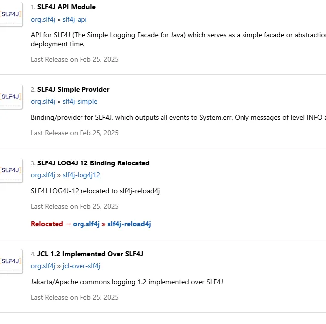
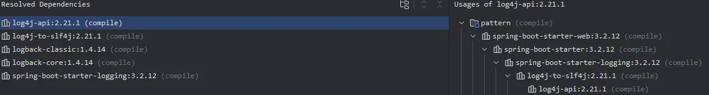

# 日志Logger-JCL，Slf4j

在spring boot logging章节开头有这么一句话：

> Spring Boot uses Commons Logging for all internal logging but leaves the underlying log implementation open. Default configurations are provided for Java Util Logging, Log4j2, and Logback. In each case, loggers are pre-configured to use console output with optional file output also available.
> 
> Spring Boot 在所有内部日志记录中使用 Commons Logging，但将底层的日志实现保持开放。它为 Java Util Logging、Log4j2 和 Logback 提供了默认配置。在每种情况下，日志记录器都已预先配置为使用控制台输出，并可选择性地启用文件输出。

那么Commons Logging是什么？

## Apache Comming Logging(JCL)

我们查看官方文档找到说明：

> The Logging package is an ultra-thin bridge between different logging implementations. A library that uses the commons-logging API can be used with any logging implementation at runtime. Commons Logging comes with support for a number of popular logging implementations, and writing adapters for others is a reasonably simple task.
> 
> Logging 包是在不同日志实现之间提供的一座极简桥梁。使用 Commons Logging API 的库可以在运行时与任意日志实现配合使用。Commons Logging 内置支持多种流行的日志实现，而为其他日志框架编写适配器也是一项相当简单的任务。

他的出发点是：市面上有很多的日志框架的实现，当某个依赖库的开发者开发一个通用库的时候，无法在库里面强制使用某一个固定的日志框架实现，当应用程序依赖了这个库，二者使用的日志框架可能不同，Commons logging则提供了一个统一的日志接口，在应用程序中直接使用Commons logging的api，而不需要与某个具体的日志框架的api进行绑定。

**在spring boot中，当我们使用starter的时候默认使用的是logback实现**。

当我们使用lombok日志注解的时候，可以很方便的自动帮我们生成下面结构的常量：

```java
Example:
@Slf4j
public class LogExample {
}

will generate:
public class LogExample {
    private static final org.slf4j.Logger log = org.slf4j.LoggerFactory.getLogger(LogExample.class);
}
```

除此之外还有：`@CommonsLog`、`@Log`、`@Log4j`、`@Slf4j`等可以通过定位为到库的包结构查看即可。项目上使用的是`@Slf4j`，就先看一下这个注解对应的日志框架实现。

## Slf4j是什么？英文叫做：Simple Logging Facade for Java (SLF4J)。

Java 简单日志门面（SLF4J）为各种日志框架（例如 java.util.logging、logback、log4j）提供了一个简单的门面或抽象层，允许最终用户在部署时插入所需的日志框架。SLF4J 允许最终用户在部署时插入所需的日志框架。

请注意，为您的库或应用程序启用 SLF4J 仅需添加一个必需的依赖项，即 slf4j-api-2.0.17.jar。

如前所述，SLF4J 旨在作为各种日志框架的门面。SLF4J 的发行版包含多个称为“提供者（provider）”的 JAR 文件，每个提供者对应一个受支持的日志框架。请注意，SLF4J 1.7 及更早版本中使用术语“绑定（binding）”来指代这些提供者。

我们在mvnrepository中搜索slf4j可以查看到一些Provider和Binding的词条：



这里我们只关注Apache Log4j SLF4J Binding ，点进去任意一个可以看到依赖坐标：

```xml
<!-- https://mvnrepository.com/artifact/org.apache.logging.log4j/log4j-slf4j-impl -->
<dependency>
    <groupId>org.apache.logging.log4j</groupId>
    <artifactId>log4j-slf4j-impl</artifactId>
    <version>version</version>
    <scope>compile</scope>
</dependency>
```

再通过Slf4j官网的图来直观感受一下Slf4j所处的位置和作用：


再加上log4j 2的话，那流程就是：*application-->SLF4J API(slf4j-api.jar)-->Adaptation layer(log4j-slf4j-impl.jar)-->Undering logging framework(log4j-core.jar)。*

由此可以看出，应用想要切换日志框架实现的时候，除了**添加对应日志框架的依赖之外，还需要查看是否需要适配层（Adaptation layer）**。

先来看一下纯净的spring boot的日志依赖，只添加了spring-boot-starter-web:3.2.12依赖：



在依赖中我们看到的是log4j-to-slf4j，那么他和我们之前的*log4j-slf4j-impl*有什么联系呢？

| log4j-to-slf4j   | 作用：将 Log4j 2 的 API 调用 转发到 SLF4J。使用场景：你的应用或依赖库使用了 Log4j 2 的 API（如 `**org.apache.logging.log4j.Logger**`），但你希望底层实际使用 SLF4J + 其他日志实现（如 Logback） 来输出日志。 |
| ---------------- | ------------------------------------------------------------ |
| log4j-slf4j-impl | 作用：将 SLF4J 的 API 调用 转发到 Log4j 2。使用场景：你的应用使用 SLF4J API（如 `**org.slf4j.Logger**`） 编写日志，但希望底层由 Log4j 2 来实际处理和输出日志。 |

我们再来分析上面的依赖关系，有log4j-to-slf4j，slf4j-api和logback-classic，因此当我们代码中使用Log4j的api的时候，底层实际使用的是logback-classic的日志实现。我们可以通过自定义日志的配置文件xml来验证一下，在类路径下添加logback-spring.xml文件，文件内容填写为下面的内容，这里使用的版本是3.2.12，不同的版本，这里面的配置不同启动会报错。具体配置以spring boot对应版本的[仓库](https://github.com/spring-projects/spring-boot/blob/v3.2.12/spring-boot-project/spring-boot/src/main/resources/org/springframework/boot/logging/logback/defaults.xml)为准。

```xml
<?xml version="1.0" encoding="UTF-8"?>

<!--
Console appender logback configuration provided for import, equivalent to the programmatic
initialization performed by Boot
-->
<configuration>
    <conversionRule conversionWord="applicationName" converterClass="org.springframework.boot.logging.logback.ApplicationNameConverter" />
    <conversionRule conversionWord="clr" converterClass="org.springframework.boot.logging.logback.ColorConverter" />
    <conversionRule conversionWord="correlationId" converterClass="org.springframework.boot.logging.logback.CorrelationIdConverter" />
    <conversionRule conversionWord="wex" converterClass="org.springframework.boot.logging.logback.WhitespaceThrowableProxyConverter" />
    <conversionRule conversionWord="wEx" converterClass="org.springframework.boot.logging.logback.ExtendedWhitespaceThrowableProxyConverter" />

    <property name="CONSOLE_LOG_PATTERN" value="${CONSOLE_LOG_PATTERN:-%clr(%d{${LOG_DATEFORMAT_PATTERN:-yyyy-MM-dd'T'HH:mm:ss.SSSXXX}}){faint} %clr(${LOG_LEVEL_PATTERN:-%5p}) %clr(${PID:- }){magenta} %clr(---){faint} %clr(%applicationName[%15.15t]){faint} %clr(${LOG_CORRELATION_PATTERN:-}){faint}%clr(%-40.40logger{39}){cyan} %clr(:){faint} %m%n${LOG_EXCEPTION_CONVERSION_WORD:-%wEx}}"/>
    <property name="CONSOLE_LOG_CHARSET" value="${CONSOLE_LOG_CHARSET:-${file.encoding:-UTF-8}}"/>
    <property name="CONSOLE_LOG_THRESHOLD" value="${CONSOLE_LOG_THRESHOLD:-TRACE}"/>

    <appender name="CONSOLE" class="ch.qos.logback.core.ConsoleAppender">
        <filter class="ch.qos.logback.classic.filter.ThresholdFilter">
            <level>${CONSOLE_LOG_THRESHOLD}</level>
        </filter>
        <encoder>
            <pattern>${CONSOLE_LOG_PATTERN}</pattern>
            <charset>${CONSOLE_LOG_CHARSET}</charset>
        </encoder>
    </appender>
    <root level="INFO">
        <appender-ref ref="CONSOLE"/>
    </root>
</configuration>
```

启动之后，打印日志即可验证。

另外，如果我们的spring boot项目依赖处理不当，或者引入了一个其他的内部中间件之后，在spring boot项目启动的时候会经常遇到一个警告信息：

```xml
SLF4J(W): Class path contains multiple SLF4J providers.
SLF4J(W): Found provider [ch.qos.logback.classic.spi.LogbackServiceProvider@5a01ccaa]
SLF4J(W): Found provider [org.apache.logging.slf4j.SLF4JServiceProvider@71c7db30]
SLF4J(W): See https://www.slf4j.org/codes.html#multiple_bindings for an explanation.
SLF4J(I): Actual provider is of type [ch.qos.logback.classic.spi.LogbackServiceProvider@5a01ccaa]
```

出现这个原因是因为我刚刚引入了这个依赖`spring-boot-starter-log4j2`，再来看依赖结构：


此时，依赖项中多出了log4j-core和log4j-slf4j2-impl的依赖。项目中存在logback-classic和**log4j2-core**两种日志框架的实现，所以slf4j会给出这样的提示。如果我们要使用log4j2的实现，排除掉`spring-boot-starter-logging`依赖项即可。

### 在spring boot中自定义日志框架的配置

我们在spring boot中如何通过xml来配置我们的日志呢？根据spring boot的官方信息如下：

| **Logging System**      | **Customization**                                            |
| ----------------------- | ------------------------------------------------------------ |
| Logback                 | `logback-spring.xml`, `logback-spring.groovy`, `logback.xml`, or `logback.groovy` |
| Log4j2                  | `log4j2-spring.xml` or `log4j2.xml`                          |
| JDK (Java Util Logging) | `logging.properties`                                         |

### Commons Logging与Slf4j的对比

| 维度           | **Commons Logging (JCL)**                                 | **SLF4J**                                                    |
| -------------- | --------------------------------------------------------- | ------------------------------------------------------------ |
| **诞生时间**   | 2002 年（较早）                                           | 2006 年（为改进 JCL 而生）                                   |
| **作者**       | Apache                                                    | Ceki Gülcü（Log4j/Logback 作者）                             |
| **绑定机制**   | 使用 **动态发现 + 类加载器**（易受 classloader 问题影响） | 使用 **编译时依赖 + 静态绑定**（更可靠、性能更好）           |
| **API 设计**   | 较老旧，方法如 `log.info("msg")`                          | 更现代，支持 **占位符**：`logger.info("Hello {}", name)`（避免字符串拼接开销） |
| **异常处理**   | `logger.error("msg", throwable)`                          | 同左，但结合占位符更灵活                                     |
| **桥接能力**   | 支持有限                                                  | 提供完善的 **桥接包（bridges）**，可统一各种日志调用到 SLF4J |
| **社区与趋势** | 已基本停止演进（Apache 将其归档）                         | 活跃维护，Spring Boot、Hibernate 等主流框架默认采用          |

SLF4J 是对 Commons Logging 的现代化替代，通过桥接机制（jcl-over-slf4j）可以无缝接管所有基于 Commons Logging 的日志调用，实现统一日志管理。在开发新项目的时候，直接选择使用Slf4j，而对于陈旧的Common Logging的项目，通过使用桥接器完成到Slf4j的切换。